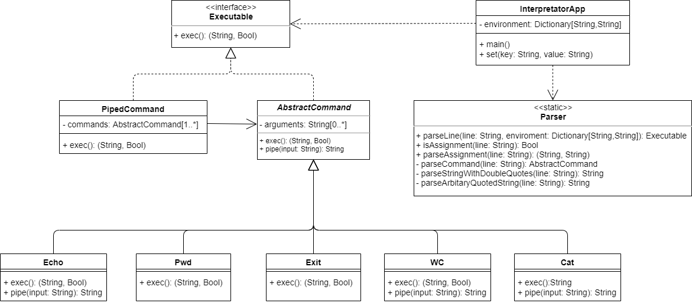

## Требования
- Функциональные требования
    - Ввод и исполнение команд
        - `cat [FILE]` — вывести на экран содержимое файла
        - `echo` — вывести на экран свой аргумент (или аргументы)
        - `wc [FILE] ` — вывести количество строк, слов и байт в файле
        - `pwd` — распечатать текущую директорию
        - `exit` — выйти из интерпретатора
    - Одинарные и двойные кавычки (full and weak quoting)
        - внутри одинарных кавычек значение строки берется как есть
        - внутри двойных кавычек доступен  слеш “\” и подставляются значения переменных
            - “path is $PATH” -> `path is /etc/passwd`
    - Окружение (команды вида “имя=значение” для объявления переменных), оператор $ для подстановки значения переменной
    - Вызов внешней программы, если введено что-то, чего интерпретатор не знает
    - Пайплайны (оператор «|»), перенаправляющий вывод одной команды на вход другой
## Архитектурные требования
- Легко добавлять новые команды
- Четкое разграничение ответственности между элементами архитектуры
- Наличие словесного архитектурного описания
## Функциональные тесты
- Следующие команды выполнимы
    ```bash
    > echo "Hello, world!"
    Hello, world!
    ```
    ```bash
    > FILE=example.txt
    > cat $FILE
    Some example text
    ```
    ```bash
    > cat example.txt | wc
    1 3 18
    ```
    ```bash
    > echo 123 | wc
    1 1 3
    ```
    ```bash
    > x=ex
    > y=it
    > $x$y
    ```
    ```bash
    > echo “path is $PATH”
    path is /some/path
    ```
    ```bash
    > echo ‘path is $PATH’
    path is $PATH
    ```
    ```bash
    > main.exe
    Hello, World!
    ```
    
    ```bash
    > cat file | exit
    ```
- Легко добавить новую команду

## Описание архитектуры
UML диаграмма классов интерпретатора представлена на следующем изображении:



Главным классом приложения является класс `InterpreterApp`, который содержит входную точку в приложение интерпретатора. Поле `environment` класса `EnvironmentVars` содержит все переменные окружения, обьявленные пользователем. Работа класса `InterpreterApp` может быть описана следующим псевдокодом:
```java
void init() {
    CommandFactory.addComand("echo", (args) => new Echo(args));
    CommandFactory.addComand("exit", (args) => new Exit(args));
    CommandFactory.addComand("cat", (args) => new Cat(args));
    CommandFactory.addComand("wc", (args) => new WC(args));
    CommandFactory.addComand("pwd", (args) => new Pwd(args));
}
void main() {
    init();
    while (true) {
        line = input();
        if (Parser.isAssignment(line)) {
            this.set(Parser.parseAssignment(line));
        } else {
	    if (Parser.isPipeline(line)
                cmd = PipedCommandFactory.construct(Parser.parsePipeline(line));
	    else
                cmd = CommandFactory.construct(Parser.parseCommand(line));
            res, status_code = cmd.exec();
            print(res);
            if (status_code == ErrorCode.EXITED)
                break;
	    else if (status_code != ErrorCode.SUCCESS)
	    	print(f"Error occured: {status_code}")
        }
    }
}
```
В процессе работы командная строка вводится пользователем в переменную `line`. Затем проверяется, что строка одна из трех типов: `isAssignment`, `parseAssignment` для парсинга присваивания переменной окружения; `isPipeline`, `parsePipeline` для парсинга команд с пайплайном; `parseCommand` для одиночной команды. В случае, если строка - присваивание переменной, то переменная и ее значение заносятся в `InterpreterApp.environment` с помощью `InterpreterApp.set`, если строка - пайплайн, то строится экземпляр `Executable`, выполняющий этот пайплайн с помощью `PipedCommandFactory`, иначе команда строится с помощью `CommandFactory`, как показано в псевдокоде выше.

Приватные методы класса `Parser` нужны для разбора строки и подстановки значений переменных. Метод `parseArbitaryQuotedString` принимает строку с произвольными кавычками и обрабатывает ее соответственно. Для работы со строкой с двойными кавычками вызывается метод `parseStringWithDoubleQuotes`. Подстановка переменных выполняется следующим образом:
```java
String parseStringWithDoubleQuotes(line) {
    bool changed = true;
    while (changed) {
        changed = false;
        for (varname, value in self.vars.items()) {
	    if (varname in line) {
    	        line = line.replace(varname, value);
		changed = true;
            }
        }
    }
    return line;
}
```
После этого не остается неподставленных переменных, и даже, если появятся пробелы, методы `parseCommand`, `parsePipeline`, `parseAssignment` смогут разделить строку по пробелам.

`CommandFactory` хранит словарь, который сопоставляет названию команды функцию, которая принимает массив строк и возвращает сконструированную команду в виде `Executable`. Метод `construct` принимает список строк, содержащий название команды и ее аргументы, и возвращает сконструированную с помощью словаря команду, если название команды есть в словаре, иначе экземпляр `ExternalCommand`. Другая фабрика `PipedCommandFactory` имеет один метод `construct`, принимающий массив массивов строк, которые содержат название команды и список аргументов, которые затем передаются в `CommandFactory.construct` и используются для конструирования `PipedCommand`.

В `cmd` записывается результат метода `Parser.parse`. Эта переменная хранит экземпляр интерфейса `Executable`, а значит является либо экземпляром `PipedCommand`, либо экземпляром одного из наследников абстрактного класса `AbstractCommand`. Далее вызывается метод `exec` этого обьекта, выполняющий соответствующую команду. Для поддержки пайплайнов метод `exec` класса `AbstractCommand` принимает в качестве аргумента вывод предыдущей команды или `null`, если его нет. Тогда метод `PipedCommand.exec` выглядит следующим образом:
```java
(String, ErrorCode) exec(input) {
    out, status_code = this.commands.exec();
    for cmd in this.commands[1:] {
        if (status_code != ErrorCode.SUCCESS)
            break;
        out, status_code = cmd.exec(out);
    }
    return out, status_code
}
```
Сами команды реализуются в виде наследников абстрактного класса `AbstractCommand` с помощью имплементации соответствующего поведения метода `exec`. Дефолтное поведение для команды определено в классе `AbstractCommand` подобным образом:
```java
(String, ErrorCode) exec(input: String = null) {
    return ("", ErrorCode.SUCCESS);
}
```
Команда `echo`, например, будет выглядеть так:
```java
class Echo : AbstractCommand {
    override (String, ErrorCode) exec(input) {
        res = " ".join(this.arguments + [input]);
        return (res, ErrorCode.SUCCESS);
    }
}
```
Для вызова внешних команд используется класс команды `ExternalCommandExecuter`, первым аргументом которого является имя программы, которую нужно вызвать.

Для проброса ошибок используются коды ошибок, определенные в перечислении(Enum) `ErrorCode`. В частности, важны следующие коды: `ErrorCode.SUCCESS`, означающий, что команда успешно завершилась, `ErrorCode.EXITED`, означающая, что нужно прекратить выполнение команд. Все остальные коды являются ошибками, которые выводятся пользователю.

Для добавления новой команды достаточно реализовать нового наследника класса `AbstractCommand` и добавить привязку названия команды к конструктору в `CommandFactory` с помощью добавления в `InterpreterApp.init` следующей строки:
```java
CommandFactory.addCommand("echo", (args) => Echo(args));
```

Приведенная архитектура проходит все описанные выше функциональные требования, позволяет легко добавлять новые команды и содержит модули с четко разделенной ответственностью. Также есть поддержка ошибок программ, отображаемых пользователю.
