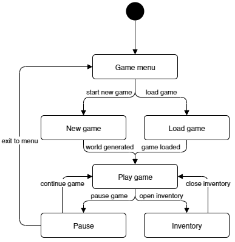

\**Диаграмма компонентов**
\**Диаграмма классов**

Главный класс игры, с которого начинается приложение - это класс **Game**. В нем хранится **GameState**, который согласно паттерну _Состояние_ использует несколько состояний для разных состояний игры. Диаграмма состояний представителей **GameState** изображена на следующей диаграмме:



В каждом состоянии определяются методы _processInput_, _update_ и _draw_, реализующие активность соответствующего состояния. _processInput_ в разных состояниях при нажатии на одну и ту же кнопку, должен делать разные действия, например, в меню кнопка "вниз" выберет следующий пункт меню, а в игре переместит персонажа вниз. Поэтому для взаимодействия с пользователем используются _Команды_ из соответствующего паттерна для каждой кнопки и каждого состояния. Кнопки, которые не нужны состоянию игры(например кнопка влево в меню) соответственно не создаются.
## Процесс игры. Паттерн Game loop
Сама игра работает согласно паттерну _Game loop_, то есть в цикле вызываются три функции:
```kotlin
processInput();
update();
draw();
```
Которые делают следующее:
- _processInput_ - взаимодействуют с пользователем
- _update_ - обновляют игровые сущности, просчитывает поведение, передвижение и атаки мобов
- _draw_ - отрисовывает карту и персонажей

Для этого, класс состояния игры(а именно те, во время которых происходит сама игра, то есть **Play game**, **Pause** и **Inventory**) хранит список представителей интерфейса **Creature**, которые умеют обновляться и отрисовываться.

### Метод processInput

Как уже было сказано, для взаимодействия с пользователем используется паттерн **Команда**, которые создаются и выполняются методе _processInput_.

### Метод update

Обновление мобов происходит следующим образом:

```kotlin
for (creature : this.creatures) {
	creatureCoords = mob.getCoords();
	neighbourhood = this.map.getNeighbourhood(creatureCoords); // Окрестность на карте
	nearCreatures = this.getNeighbourhood(creatureCoords);
	creature.update(nearCreatures, neighbourhood);
}
for (creature : this.creatures) {
	if (creature.isDead()) {
		// gain EXP to player
		// create loot using LootDirector and give it to player
	}
}
```

То есть персонажу передается окрестность карты и ближайшие существа, вызывается его _update_ и если существо умерло, то игроку добавляется опыт и предметы.

### Метод draw

Метод _draw_ просто отрисовывает карту и персонажей:

```kotlin
map.draw();
for (creature : this.creatures)
	creature.draw();
```

## Генерация лута

Для генерации лута состояние игры использует класс **LootDirector**, работающий с абстрактной фабрикой лута. При смерти моба, **LootDirector** берет его _lootRow_, содержащий вероятности выпадения предметов, после чего **LootDirector**, используя соответствующие фабрики, создает лут согласно этим вероятностям. Конкретные фабрики, реализующие интерфейс абстрактной фабрики **AbstractLootFactory** генерируют предметы разной редкости:

- **CommonLootFactory** - обычные предметы
- **RareLootFactory** - редкие предметы

и так далее.

## Спавн и характеристики мобов

Мобы также генерируются с помощью абстрактной фабрики **AbstractMobFactory**, которая принимает характеристики моба и создает моба из какого-то семейства с соответствующими характеристиками. Другими словами, используется паттерн мост, в котором абстракция - вид моба, а реализация - его характеристика. На схеме в качестве примера приведены разные виды характеристики атаки(**MeleeAttack** и **RangeAttack**) и передвижения(**WalkMovement** и **FlyMovement**). В качестве примеров конкретных фабрик приведены две фабрики мобов - зомби **ZombieFactory** и скелетов **SkeletonFactory**, соответствующие продукты - наследники абстрактного продукта **AbstractMob**: зомби **Zombie** и скелет **Skeleton**.

И мобы и игрок являются реализациями абстрактного класса **Creature**, внутри которого хранятся координаты существа и его статы: характеристики, здоровье, сила атаки и т.д.

## Поведение мобов

Для реализации поведения мобов используется паттерн **Состояние**, которое хранится внутри моба и имеет метод _update_, реализующий поведение в соответствующем состоянии и, по необходимости, меняющий состояние. Таким образом сами методы _update_ внутри каждого состояния представляют собой паттерн **Стратегия**, меняющий поведение моба.

## Система прокачки

Для хранения и работы с уровнем игрока выделен отдельный класс **Level**, в котором хранятся:

- _currentXP_ - текущее количество опыта на новый уровень
- _neededXP_ - нужное количество уровня для левелапа
- _level_ - текущий уровень

Влияние опыта на характеристики учитывается вместе с влиянием предметов в _Entity.getStats()_, так как и предметы и **Level** могут обновлять статы персонажа методами вида ```Stats -> Stats```.
