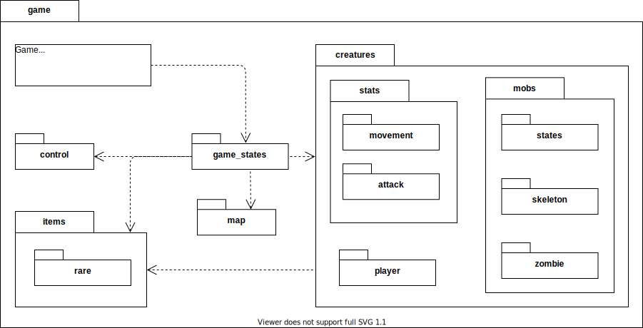
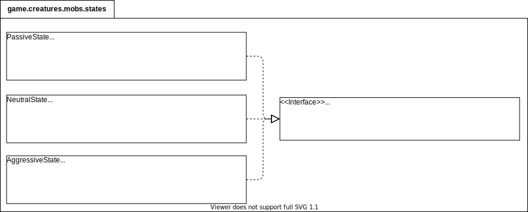

# Диаграмма компонентов



Вся программная реализация распологается в глобальном компоненте _game_.

# Диаграмма классов
[Ссылка](img/everything.svg) на полную диаграмму классов.

# Поток управления игры

Точка входа в игру находится в классе верхнего уровня **Game** в методе _main_. В нем хранится **GameState**, который согласно паттерну _Состояние_ использует несколько классов для разных состояний игры. Диаграмма состояний представителей **GameState** изображена ниже:


В каждом состоянии определяются методы _processInput_, _update_ и _draw_, реализующие соответствующие активности. _processInput_ в разных состояниях при нажатии на одну и ту же кнопку должен делать разные действия, например, в меню кнопка "вниз" выберет следующий пункт меню, а в игре переместит персонажа вниз. Поэтому для взаимодействия с пользователем используются _Команды_ из соответствующего паттерна для каждой кнопки и каждого состояния. Кнопки, которые не нужны состоянию игры(например кнопка влево в меню) соответственно не создаются.

Датакласс **GameInfo** содержит общие данные для состояний **Play game**, **Pause** и **Inventory**, а именно те данные, которые сохраняются между состояниями: список существ, карта и фабрики лута и мобов.

Диаграмма классов состояний игры изображена ниже:


## Процесс игры. Паттерн Game loop

Сама игра работает согласно паттерну [_Game loop_](https://gameprogrammingpatterns.com/game-loop.html), то есть в цикле вызываются три функции:
```kotlin
processInput();
update();
draw();
```
Которые делают следующее:
- _processInput_ - взаимодействует с пользователем
- _update_ - обновляет игровые сущности, просчитывает поведение, передвижение и атаки мобов
- _draw_ - отрисовывает карту и персонажей

Для этого, класс состояния игры(а именно те, во время которых происходит сама игра, то есть **Play game**, **Pause** и **Inventory**) хранит список представителей интерфейса **Creature**, которые умеют обновляться и отрисовываться.

### Метод processInput

Как уже было сказано, для взаимодействия с пользователем используется паттерн **Команда**, которые создаются и выполняются в методе _processInput_.

Диаграмма классов обеспечивающих взаимодействие с пользователем изображена ниже:


### Метод update

Обновление мобов происходит следующим образом:

```kotlin
for (creature : this.creatures) {
	creatureCoords = mob.getCoords();
	neighbourhood = this.map.getNeighbourhood(creatureCoords); // Окрестность на карте
	nearCreatures = this.getNeighbourhood(creatureCoords);
	creature.update(nearCreatures, neighbourhood);
}
for (creature : this.creatures) {
	if (creature.isDead()) {
		// gain EXP to player
		// create loot using LootDirector and give it to player
	}
}
```

То есть персонажу передается окрестность карты и ближайшие существа, вызывается его _update_ и если существо умерло, то игроку добавляется опыт и предметы.

### Метод draw

Метод _draw_ просто отрисовывает карту и персонажей:

```kotlin
map.draw();
for (creature : this.creatures)
	creature.draw();
```

## Генерация лута


Для генерации лута состояние игры использует класс **LootDirector**, работающий с абстрактной фабрикой лута. При смерти моба, **LootDirector** берет его _lootRow_, содержащий вероятности выпадения предметов, после чего **LootDirector**, используя соответствующие фабрики, создает лут согласно этим вероятностям. Конкретные фабрики, реализующие интерфейс абстрактной фабрики **AbstractLootFactory**, генерируют предметы разной редкости:


- **CommonLootFactory** - обычные предметы
- **RareLootFactory** - редкие предметы

и так далее.

## Спавн и характеристики мобов


Все существа(а именно игрок и мобы) наследуются от абстрактного класса **Creature**, который содержит методы _update_ и _draw_ для обеспечения работы паттерна _Game loop_. В качестве полей, **Creature** содержит свои координаты и статы, которые описаны в следующем пункте.

Мобы генерируются с помощью абстрактной фабрики **AbstractMobFactory**, которая принимает параметры моба(тип атаки, передвижения и т.д.) и создает моба из некого семейства(например зомби или скелета) с соответствующими характеристиками. Другими словами, используется паттерн _Мост_, в котором абстракция - тип моба, а реализация - его характеристики. На схеме в пункте _Статы мобов_ в качестве примера приведены разные виды характеристики атаки(**MeleeAttack** и **RangeAttack**) и передвижения(**WalkMovement** и **FlyMovement**). В качестве примеров конкретных фабрик в схеме выше приведены две фабрики мобов - зомби **ZombieFactory** и скелетов **SkeletonFactory**, соответствующие продукты - наследники абстрактного продукта **AbstractMob**: зомби **Zombie** и скелет **Skeleton**.

## Система прокачки

Для хранения и работы с уровнем игрока выделен отдельный класс **Level**, в котором хранятся:

- _currentXP_ - текущее количество опыта на новый уровень
- _neededXP_ - нужное количество уровня для левелапа
- _level_ - текущий уровень

Влияние опыта и предметов на характеристики персонажа учитывается с помощью применения методов _Item.apply(stats)_ и метода _Level.apply(stats)_, учитывающего уровень персонажа.


### Статы мобов


Для каждого представителя **Creature** в поле _stats_ кроме количества здоровья и урона хранятся характеристики моба такие, как тип атаки(**AttackType**) и способ передвижения(**MovementType**), которые определяются в момент создания моба в фабрике мобов. С помощью них моб будет атаковать других существ и передвигаться по карте в методе _update_.

### Поведение мобов



Для реализации поведения мобов используется паттерн **Состояние**. Состояние моба хранится внутри него и реализует метод _update_, определяющий поведение моба в соответствующем состоянии и, по необходимости, меняющий состояние. Таким образом, сами методы _update_ внутри каждого состояния представляют собой паттерн **Стратегия**, меняющий поведение моба.

## Карта


Карта представляет собой таблицу, состоящую из тайлов(вода, земля или стена). Она предоставляет методы для отрисовки себя и получения тайлов окрестности существа, чтобы эмулировать возможность видеть. Класс **MapGenerator** реализует алгоритм генерации карты, используемый в **NewGameState**.
